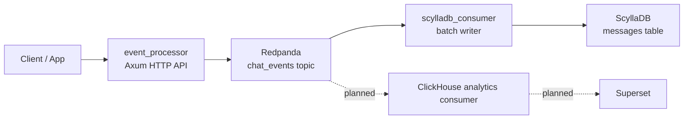

# Event Ingestion Pipeline

Chat event ingestion pipeline for accepting application events over HTTP, publishing them to Redpanda, and persisting processed events into ScyllaDB.

Current status: usable prototype. It is not production-grade yet.

## Current Shape



## Services

| Service | Path | Status | Purpose |
| --- | --- | --- | --- |
| Event processor | `event_processor/rust` | Partial | Accepts chat events, normalises payloads, publishes to Redpanda |
| Redpanda | `docker-compose.yml` | Local only | Kafka-compatible event log |
| Scylla consumer | `consumer/persistence/scylladb/rust` | Partial | Consumes `chat_events`, writes batches to ScyllaDB |
| ScyllaDB | `docker-compose.yml` | Local only | Persistent event store |
| ClickHouse consumer | `consumer/analytics/clickhouse` | Missing | Analytics path |
| Superset | `infra/superset` | Skeleton | BI surface |

## Minimum Viable Changes

These are the smallest changes required to move from "runs locally" toward "usable with known failure modes".

| Priority | Change | Why |
| --- | --- | --- |
| P0 | Use `KAFKA_BROKERS` and `SCYLLA_HOST` everywhere | Current hard-coded endpoints break Docker/local parity |
| P0 | Add Scylla schema init/migration | The writer has no owned table lifecycle |
| P0 | Align table schema with `ProcessedEvent` | Current data model and insert columns disagree |
| P0 | Commit Kafka offsets only after durable Scylla write | Current consumer can acknowledge data before persistence |
| P0 | Replace `try_send` drop behaviour with backpressure | Full channel currently loses events |
| P1 | Return correct HTTP status codes | Publish failures should not return HTTP 200 |
| P1 | Share one Redpanda producer per API process | Current per-request producer creation is expensive |
| P1 | Add health/readiness endpoints | Operators need dependency-aware service state |
| P1 | Add unit and integration tests per functional requirement | Behaviour is currently unguarded |
| P2 | Add DLQ/retry topics | Poison messages need an explicit recovery path |

## Maturity Roadmap

| Stage | Definition | Exit Criteria |
| --- | --- | --- |
| Usable | Local end-to-end flow works | Docker compose starts, event accepted, event visible in Scylla |
| Production aware | Known failure modes are explicit | Health checks, durable offset semantics, backpressure, schema migration, basic metrics |
| Production-grade | Operable under load and failure | SLOs, load tests, replay process, DLQ, dashboards, alerts, capacity model |
| Governed at scale | Auditable, cost-controlled, policy-managed | Data contracts, retention, lineage, access control, cost budgets, change approval |

## Operational Gaps

| Area | Gap |
| --- | --- |
| Economics | No throughput, storage, retention, or cost model |
| Health | No `/healthz`, `/readyz`, dependency probes, lag alarms, or Scylla write latency SLO |
| Control | No pause/resume, replay, drain, topic reset, or backfill runbook |
| Safety | Offset commits can race ahead of durable writes; full queue drops events |
| Risk | No DLQ, no schema compatibility policy, no disaster recovery plan |
| Edge | No handling for duplicates, out-of-order events, clock skew, malformed payloads, hot rooms |
| Governance | No ownership, retention policy, PII classification, audit log, or data contract registry |

## Run Locally

```bash
docker compose up -d
```

Submit a sample event:

```bash
curl -X POST http://localhost:3000/api/v1/chat/ingestion \
  -H 'Content-Type: application/json' \
  -d '{
    "event_type": "chat",
    "user_id": "user_123",
    "room_id": "room_456",
    "journey_id": "journey_999",
    "timestamp": 1733490000,
    "message": "Hello world",
    "message_type": "text",
    "chat_type": "group"
  }'
```

## Design Docs

- [v0](docs/architecture/v0/README.md): usable prototype and minimum viable boundaries
- [v1](docs/architecture/v1/README.md): production-aware version with the same implementation shape, but with explicit safety and operational requirements
