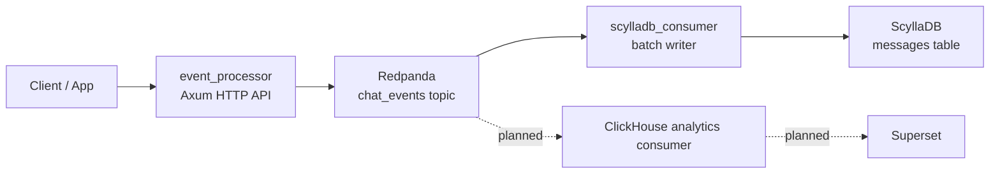

# Event Ingestion Pipeline Architecture v0

This is the usable prototype version. It captures the current implementation shape and the minimum viable changes required to make it safe enough to operate with known failure modes.

## System Design

## Minimum Viable Changes

| Priority | Change | Why |
| --- | --- | --- |
| P0 | Use `KAFKA_BROKERS` and `SCYLLA_HOST` everywhere | Hard-coded endpoints break Docker/local parity |
| P0 | Add Scylla schema init/migration | The writer has no owned table lifecycle |
| P0 | Align table schema with `ProcessedEvent` | Current data model and insert columns disagree |
| P0 | Commit Kafka offsets only after durable Scylla write | Current consumer can acknowledge data before persistence |
| P0 | Replace `try_send` drop behaviour with backpressure | Full channel currently loses events |
| P1 | Return correct HTTP status codes | Publish failures should not return HTTP 200 |
| P1 | Share one Redpanda producer per API process | Current per-request producer creation is expensive |
| P1 | Add health/readiness endpoints | Operators need dependency-aware service state |
| P1 | Add unit and integration tests per functional requirement | Behaviour is currently unguarded |
| P2 | Add DLQ/retry topics | Poison messages need an explicit recovery path |

## V0 Boundaries

| Area | Bound |
| --- | --- |
| Scope | HTTP ingest, publish to Redpanda, persist to Scylla |
| Safety | No silent drop-on-full semantics; no commit-before-write |
| Operations | Basic logs, basic health, explicit config |
| Governance | Not yet governed at scale |

## Maturity Gate

V0 is acceptable only if the pipeline is usable and the failure modes are explicit.

