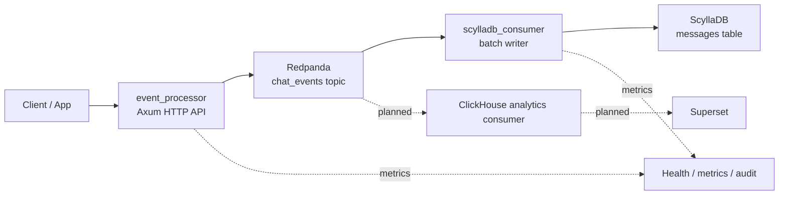

# Event Ingestion Pipeline Architecture v1

This is the production-aware version. It uses the same implementation shape as v0, but it adds explicit operational boundaries so the pipeline can be bounded for risk before it is treated as production-grade.

## System Design

## Production-Aware Requirements

| Area | Requirement | Why |
| --- | --- | --- |
| Config | Env-driven broker, topic, Scylla host, timeouts, batch size | Removes hidden environment coupling |
| Safety | Commit offsets only after durable Scylla write | Prevents acknowledged loss |
| Backpressure | No event drop when the queue is full | Converts overload into bounded latency |
| Health | Liveness and readiness endpoints | Makes dependency state visible |
| Observability | Metrics for ingest, publish, lag, batch latency, failures | Enables detection and response |
| Recovery | DLQ and replay plan | Bounds poison-message and outage risk |
| Tests | One test per FR and failure mode | Prevents regression in safety guarantees |

## V1 Boundary

| Area | Bound |
| --- | --- |
| Scope | Same implementation path as v0 |
| Risk | Explicitly bounded and observable |
| Control | Operational readiness required before rollout |
| Governance | Still not governed at scale, but now ready for controls to be layered in |

## Production-Aware Exit Criteria

V1 is acceptable only when the pipeline can fail loudly, recover deliberately, and expose its state to operators.

