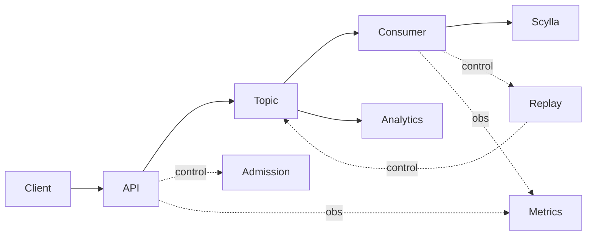
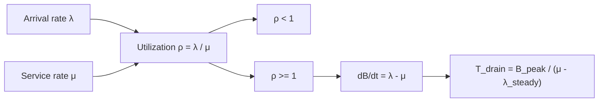
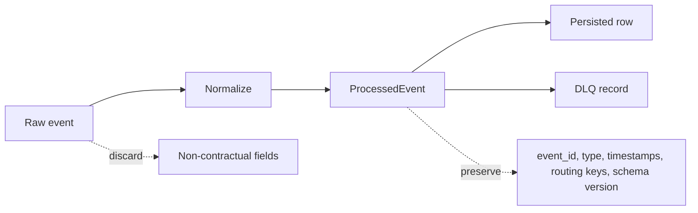
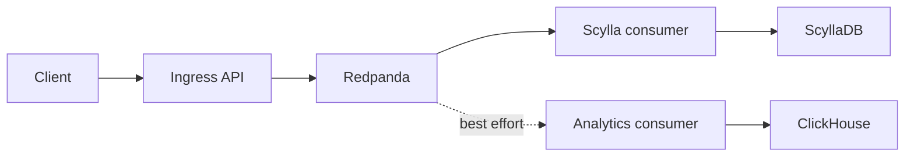
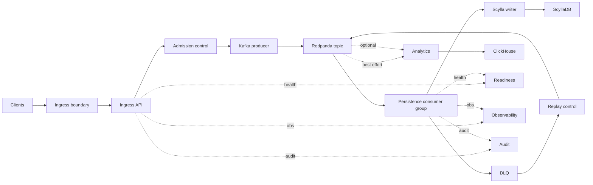
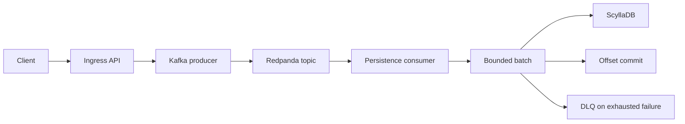
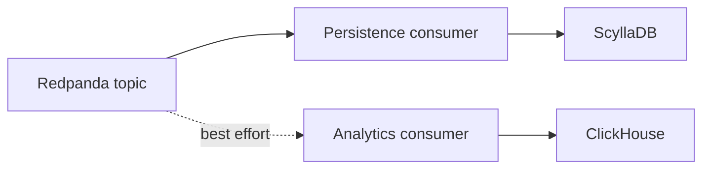
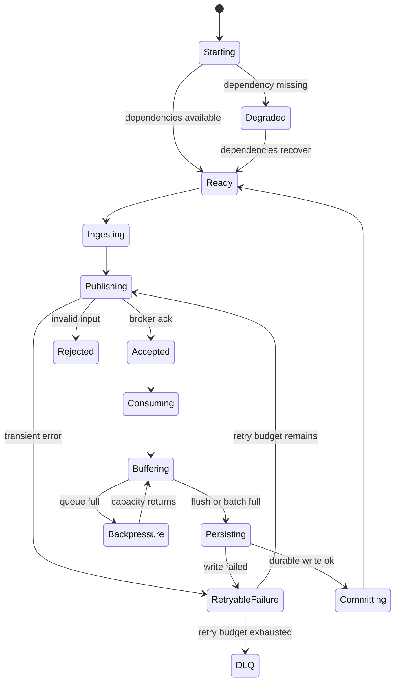

# Event Ingestion Pipeline v1

## Scope

`v0` is the current implementation baseline: HTTP ingest, Redpanda publish, Scylla persistence, and optional ClickHouse analytics fanout.

`v1` evolves `v0` into a production-aware system by adding:
- explicit correctness contracts
- quantified workload and capacity assumptions
- bounded queues, retries, and replay
- explicit control policies for overload and dependency degradation
- observable and auditable recovery paths

`v0` gaps:
- hard-coded dependency addresses
- no owned schema lifecycle
- no health or readiness contract
- no DLQ or replay path
- no commit-after-write safety guarantee
- no quantified load envelope
- no failure-mode tests
- no observability contract
- no rollout or rollback discipline
- no capacity or cost model

## Assumptions

### Workload model

| Parameter | Assumption |
| --- | --- |
| Average request body | `2 KiB` |
| p99 request body | `16 KiB` |
| Hard request body cap | `64 KiB` |
| Event types | chat, join, leave, reaction |
| Average ingress rate | `1,000 req/min` |
| Burst ingress rate | `5,000 req/min` for `60 s` |
| Partitioning assumption | `12` topic partitions |
| Consumer concurrency | `1` consumer group, up to `12` active partition workers |
| Average Scylla write batch | `250` events |
| Max Scylla write batch | `500` events |
| Replay assumption | retained topic replay for `24 h` |
| Room skew assumption | top `1%` of rooms may generate `20%` of traffic |

These are spec inputs. If measured workload or dependency capacity differs materially, the budgets below are invalid and must be recomputed.

### Quantified targets

| Metric | Target |
| --- | --- |
| Max request body | `64 KiB` |
| API request timeout | `2 s` |
| Publish timeout | `5 s` |
| Consumer flush interval | `2 s` |
| Consumer batch size | `500` events |
| Consumer queue depth | `10,000` events |
| Retry budget per unit of work | `3` attempts |
| DLQ threshold | after `3` failed attempts |
| API p95 latency | `< 250 ms` on accepted requests |
| Broker publish p95 | `< 500 ms` |
| Scylla write p95 | `< 1 s` per batch |
| Consumer lag | `< 30 s` sustained |
| Recovery time objective | `< 15 min` for single dependency outage |
| Error budget | `<= 0.1%` acknowledged failures per day |
| Duplicate tolerance | at-least-once, controlled by stable `event_id` |
| Overload behavior | return `429` or `503`, never silent drop |

## Correctness

### Functional requirements

| ID | Requirement | Minimum validation |
| --- | --- | --- |
| FR1 | Accept valid chat events over HTTP | unit + API tests |
| FR2 | Reject malformed or malicious input | schema, size, and type tests |
| FR3 | Publish accepted events to Redpanda | broker success and failure tests |
| FR4 | Persist consumed events to ScyllaDB | integration tests against durable write path |
| FR5 | Preserve delivery semantics under failure | commit-after-write tests |
| FR6 | Expose operator-visible health | liveness and readiness tests |
| FR7 | Bound overload behavior | queue saturation and dependency degradation tests |

### Non-functional requirements

#### Invariants
- No event acknowledged with `202` is silently lost.
- No offset is committed before durable storage.
- No unbounded queue, retry, or buffer growth occurs.
- Invalid input never reaches the main topic.
- Safety is not sacrificed to preserve latency.

#### Guarantees
- Invalid input fails early and cheaply.
- Dependency degradation is externally visible.
- Duplicate delivery is tolerated explicitly.
- Overload degrades predictably.

#### Constraints

Economic:
- broker, storage, compute, and operator attention are finite
- retention must be explicit
- retry and replay amplification must be bounded

Operational:
- rollout phases must be distinct
- recovery must be bounded by runbook and replay path
- deploy and rollback must preserve correctness invariants

#### Qualities to optimize for

| NFR | Optimize | Why |
| --- | --- | --- |
| acknowledged loss | minimize to `0` | core correctness boundary |
| invalid work admitted | minimize to `0` | prevents bad demand from consuming durable capacity |
| duplicate side effects | minimize | at-least-once is tolerated, duplicate impact is not free |
| queue depth | target bounded `< 80%` in steady operation | preserves headroom for bursts and replay |
| consumer lag | target `< 30 s` sustained | keeps recovery and operator action bounded |
| publish latency | minimize subject to safety | acceptance should be fast but never unsafe |
| durability latency | minimize subject to commit-after-write | protects correctness before throughput |
| retry amplification | minimize | retries consume broker, DB, and operator budget |
| replay amplification | minimize | replay is recovery, not normal throughput |
| observability lag | minimize | hidden failures expand blast radius |
| operator intervention | minimize | manual steps do not scale and increase risk |
| analytic completeness | maximize only within best-effort budget | analytics must not steal capacity from durability |
| throughput | maximize within queue, CPU, DB, and correctness bounds | throughput is valuable only if bounded |
| availability | maximize subject to fail-closed durability rules | unsafe acceptance is worse than explicit rejection |

Conflict resolution rules:
- correctness beats availability
- durability beats latency
- bounded resource use beats short-term throughput spikes
- core write path beats best-effort analytics
- explicit rejection beats hidden overload

### Correctness contract

Must never happen:
- acknowledged event loss without durable persistence or durable failure record
- offset commit before durable write
- unbounded retries, queues, or memory growth
- lossy transforms on replay-critical fields

May happen under stress:
- duplicate delivery
- higher latency
- explicit `429` or `503`
- DLQ routing after bounded retry exhaustion

Sacrificed under overload:
- immediate acceptance rate
- latency targets
- non-critical analytics fanout

### Delivery semantics

#### Write path semantics

- ingress to topic is **ack-after-broker-ack**
- topic to Scylla is **at-least-once consume, commit-after-durable-write**
- persistence failure after bounded retry becomes **durable DLQ**, then offset commit
- no part of the write path provides exactly-once end-to-end semantics

Implications:
- duplicates are possible across consumer restart, broker redelivery, replay, or partial failure
- silent acknowledged loss is not acceptable
- `event_id` is the stable identity used to reason about duplicate handling and replay provenance

#### Read path semantics

- Redpanda to ClickHouse is **best-effort**
- analytics failure must not block ingress, persistence, or offset safety in the durability path
- malformed analytics payloads may be skipped after logging because analytics is outside the core correctness contract

#### Failure-mode semantics

| Failure point | Delivery semantic consequence |
| --- | --- |
| request rejected before publish | no delivery; cheap fail |
| broker publish timeout or failure | no acceptance; client sees `503` |
| broker ack succeeds, consumer delayed | durable in topic; delayed persistence is allowed |
| Scylla write fails, retry budget remains | no offset commit; work remains in retry path |
| Scylla write fails, retry budget exhausted | event is preserved in DLQ; offset is committed after DLQ |
| malformed consumed payload | raw payload preserved in DLQ; main path offset committed after preservation |
| analytics insert fails | analytics loss or delay is allowed; core durability unaffected |

## Model

### Core entities

- `Event`: raw incoming request payload
- `ProcessedEvent`: normalized broker payload
- `Topic`: ordered durable event log
- `ConsumerGroup`: offset ownership and partition work assignment
- `MessageRow`: durable Scylla record
- `AnalyticsRow`: best-effort ClickHouse analytics row
- `DLQRecord`: failed event plus reason and provenance
- `AuditRecord`: schema, config, replay, deploy, and rollback history

### Decoded reality

#### Graph model

The system is a constrained directed multigraph with:
- write-path data edges: ingest -> publish -> consume -> persist
- read-path data edges: topic -> analytics consumer -> ClickHouse
- control edges: admission, readiness, replay, rollback
- observability edges: metrics, logs, traces, audit

Quantified graph constraints:
- primary path length: `4` hops from client to durable Scylla write
- optional analytics fanout: `+1` branch from topic
- publish cut set: ingress API -> Redpanda
- persistence cut set: consumer -> ScyllaDB
- analytics cut set: analytics consumer -> ClickHouse
- replay cycle count: `1` explicit cycle `DLQ -> replay -> topic`

#### Queue model

Let:
- `lambda` = arrival rate in events/sec
- `mu` = durable service rate in events/sec
- `rho = lambda / mu`
- `B(t)` = backlog at time `t`

Stability:
- stable if `rho < 1`
- unstable if `rho >= 1`
- backlog growth `dB/dt = lambda - mu`
- drain time `T_drain = B_peak / (mu - lambda_steady)` for `mu > lambda_steady`

Quantified v1 envelope:
- steady ingress: `16.7 events/s`
- burst ingress: `83.3 events/s` for `60 s`
- queue cap: `10,000` events
- required sustained service floor to drain a full queue in `10 min`: `mu > 33.4 events/s` when steady load remains `16.7 events/s`
- burst backlog estimate if `mu = 40 events/s`: `B_peak ~= 2,598`

#### Information model

Replay-critical fields:
- `event_id`
- `event_type`
- producer timestamp
- server ingest timestamp
- user and room identifiers
- normalized payload
- schema version
- failure reason for DLQ

Intentional information loss:
- transport-specific client context not required for replay
- non-contractual unknown fields unless explicitly versioned

Constraints:
- replayable records must reconstruct publish and persistence decisions
- audit records must preserve causality across ingress, broker, and persistence
- lossy transforms are forbidden on fields used for idempotency, routing, retention, or audit

## Architecture

### High-level design

### System design

### Write path

The write path is correctness-critical and producer-consumer based:
- ingress validates and normalizes HTTP requests
- ingress publishes to Redpanda and returns `202` only after broker ack
- the persistence consumer reads from the topic, batches events, writes to Scylla, then commits offsets
- if persistence exhausts bounded retry, the consumer writes a durable DLQ record and commits only after that failure path is preserved
- producer and consumer are intentionally decoupled by the topic so the write path can absorb burst, retry, and dependency skew without coupling client lifetime to database lifetime

### Read path

The read path is split:
- the durability read path is the persistence consumer reading from Redpanda into Scylla
- the analytics read path is optional and best-effort; it must not affect ingress correctness or persistence correctness
- the analytics consumer is a separate producer-consumer branch with weaker guarantees and lower priority under live pressure

### API contract

- Method: `POST`
- Path: `/api/v1/chat/ingestion`
- Success: `202 Accepted`
- Invalid input: `400` or `422`
- Overload: `429`
- Dependency degradation: `503`
- Required header: `Content-Type: application/json`
- Response fields on success: `ok`, `event_id`, `request_id`
- Response fields on error: `ok`, `code`, `message`, `request_id`

### Path-level contracts

| Path | Contract |
| --- | --- |
| Client -> Topic | request is accepted only if validation passes and broker ack is received within `5 s` |
| Topic -> ScyllaDB | offset is committed only after durable Scylla write |
| Topic -> DLQ | bounded retries end in durable failure record |
| DLQ -> Replay -> Topic | replay preserves `event_id`, schema version, and failure provenance |
| Topic -> ClickHouse | best-effort analytics path may drop or skip non-critical work without affecting durability correctness |
| Deploy -> Rollback | rollback preserves offset correctness, schema compatibility, and replayability |

### Producer-consumer implications when live

Write path:
- producers can continue briefly during consumer slowdown until topic, queue, or readiness budgets are hit
- consumer lag is the live signal that decoupling is being consumed as backlog
- once backlog risk exceeds budget, the system must shift from absorption to rejection with `429` or `503`

Read path:
- the persistence consumer is part of the correctness boundary and therefore protected first
- the analytics consumer competes for broker and compute resources but may be slowed, disabled, or allowed to miss data
- replay re-enters through the same producer-consumer topology, so replay rate must be bounded to avoid self-induced congestion

## Low-level design

### Lifecycle and state

Lifecycle:
- `Created -> Validating -> Publishing -> Published -> Consuming -> Persisting -> Committing -> Complete`
- failure branches to `Rejected`, `Retrying`, `DLQ`, or `Degraded`

State dwell targets:
- `Validating < 20 ms`
- `Publishing < 5 s`
- `Persisting < 1 s`
- retries capped at `3`

### Transition table

| State | Trigger | Guard | Action | Next state | Durable effect |
| --- | --- | --- | --- | --- | --- |
| `Created` | request received | body <= `64 KiB` | allocate context | `Validating` | none |
| `Created` | request received | body > `64 KiB` | reject request | `Rejected` | none |
| `Validating` | schema valid | dependency budget healthy | normalize, assign `event_id` | `Publishing` | none |
| `Validating` | schema invalid | always | return `400` or `422` | `Rejected` | none |
| `Publishing` | broker ack | within `5 s` | return `202` | `Published` | topic append |
| `Publishing` | broker unavailable | retry budget remains | retry publish | `Retrying` | none |
| `Publishing` | broker unavailable | retry budget exhausted | return `503` | `Degraded` | none |
| `Published` | consumer poll | message available | enqueue | `Consuming` | none |
| `Consuming` | batch full or timer | queue not empty | send batch | `Persisting` | none |
| `Persisting` | Scylla write ack | succeeds | prepare commit | `Committing` | Scylla rows written |
| `Persisting` | Scylla write fail | retry budget remains | retry write | `Retrying` | none |
| `Persisting` | Scylla write fail | retry budget exhausted | write DLQ record | `DLQ` | DLQ record written |
| `Committing` | offset commit ack | always | mark complete | `Complete` | broker offset committed |

### Cost model

Let:
- `n` = events per batch
- `s` = average serialized event bytes
- `q` = queued events
- `r_net` = network round-trip latency
- `r_broker` = broker ack latency
- `r_db` = Scylla batch write latency

Time:
- `T_ingest ~= T_validate + r_net(api->broker) + r_broker`
- `T_persist_batch ~= r_net(consumer->db) + r_db`
- `T_persist_event ~= T_persist_batch / n`
- `T_queue ~= B / mu`

Space:
- `S_queue ~= q * s`
- `S_batch ~= n * s`
- `S_replay ~= lambda * s * retention_window`

Budget consequences:
- `q = 10,000`, `s = 2 KiB` => queue payload ~ `20 MiB` before runtime overhead
- `n = 500`, `s = 2 KiB` => batch payload ~ `1 MiB` before serialization overhead
- `lambda = 16.7 events/s`, `s = 2 KiB`, `24 h` retention => raw replay storage ~ `2.9 GiB/day` before replication and metadata

### Data structures and why they exist

| Structure | Purpose | Risk mitigated | Failure if absent |
| --- | --- | --- | --- |
| Fixed-size FIFO queue | bounded consumer intake | memory growth, overload ambiguity | unbounded heap growth or drop pressure |
| Timed batch buffer | amortized Scylla writes | write amplification, unstable lag | poor throughput and unstable lag |
| Stable `event_id` | identity across publish, replay, and DLQ | duplicate corruption | non-idempotent recovery |
| DLQ record | durable failed work | poison loops, irrecoverable failures | silent loss or infinite retry |
| Correlation metadata | join ingress, broker, consumer, audit | debugging blind spots | non-falsifiable incident analysis |
| Versioned envelope | preserve replay semantics | schema drift, version skew | incompatible replay |
| Schema files under `schema/scylla` | owned storage contract | runtime/schema drift | service mutates schema implicitly |

Selection rules:
- buffers must be bounded by count, time, or bytes
- replay identities must be stable across retries
- replay-critical fields must not be dropped
- latency may not be improved by hiding pressure

## Control policy

## Deep dives

### Production implications of NFRs

#### Bounded resource use

Live implication:
- every queue, batch, timeout, and retry budget eventually becomes a visible rejection, lag increase, or DLQ increase
- bounded systems fail noisily but predictably; unbounded systems fail late and opaquely

#### Delivery correctness

Live implication:
- at-least-once means operators must expect duplicate arrival during restart, replay, and partial outage
- commit-after-write shifts risk from loss toward duplication and lag, which is the correct trade
- DLQ volume is part of the acknowledged output ledger, not an implementation detail

#### Dependency degradation

Live implication:
- broker degradation first shows up as publish latency and `503`
- Scylla degradation first shows up as consumer lag, retry growth, and DLQ pressure
- analytics degradation should remain isolated unless it begins stealing shared broker or compute capacity

#### Overload behavior

Live implication:
- overload consumes queue headroom first, then admission budget, then forces explicit rejection
- if overload is hidden, the system converts short spikes into long recovery tails
- the correct live question is not "can we accept more?" but "what invariant breaks if we do?"

#### Recovery behavior

Live implication:
- replay is not free throughput; it competes with live demand for broker, DB, and operator budget
- recovery time is governed by backlog size, sustained `mu`, and replay rate limiting
- a healthy system recovers by controlled draining, not by unconstrained catch-up

#### Observability

Live implication:
- metrics must distinguish loss risk, lag risk, and dependency risk
- without correlation between `202`, topic append, Scylla writes, and DLQ writes, delivery semantics cannot be proven live
- observability gaps increase blast radius because operators must guess state

### Failure-aware behavior

- malformed input terminates before broker publication and returns `400` or `422`
- broker failure prevents new accepted publishes beyond budget and returns `503`
- Scylla failure stops offset commit and converts work into bounded retry then DLQ
- retry amplification is bounded by retry cap `3` and queue cap `10,000`

### Degradation-aware behavior

- degraded mode is explicit, not implicit
- readiness drops when broker or Scylla health is unsafe
- `429` is used for local overload
- `503` is used for dependency unavailability or unsafe dependency state
- optional paths such as analytics fail independently before critical durability paths
- analytics is best-effort and outside the write-path correctness contract

### Edge-aware behavior

- duplicate delivery is expected and controlled through stable `event_id`
- clock skew and out-of-order events must not break replay or auditability
- top `1%` hot rooms generating `20%` of traffic must not destabilize unrelated partitions
- malformed, oversized, or bursty bad clients must terminate at the ingress boundary

### Bounded control policy

| Signal | Threshold | Control action | Protected invariant |
| --- | --- | --- | --- |
| request body size | `> 64 KiB` | reject with `400` or `422` | bad input never reaches topic |
| broker or Scylla unhealthy | readiness false | return `503`; suppress unsafe acceptance | no acknowledged silent loss |
| local queue pressure | queue depth `> 80%` | return `429`; reduce admission | bounded memory |
| consumer lag | `> 30 s` for `5 min` | reduce acceptance and raise alert | bounded delay |
| retry attempts | `>= 3` | stop retry, write to DLQ | bounded amplification |
| replay surge | replay headroom risk | rate-limit replay; disable analytics first | bounded storage and lag |
| hot-key skew | partition saturation | constrain per-partition throughput | noisy neighbor isolation |

### Tradeoff rules

| Tradeoff | Rule |
| --- | --- |
| Safety vs latency | preserve commit-after-write even if latency degrades |
| Throughput vs cost | prefer bounded batching over unconstrained fanout |
| Recovery vs simplicity | prefer explicit DLQ and replay over hidden retries |
| Availability vs correctness | reject with `429` or `503` before violating durability invariants |

## Observability and audit

### Decision support

| Question | Required signal |
| --- | --- |
| overload or dependency failure? | queue depth + dependency health + publish/write latency |
| are we losing work? | `202` count vs topic append vs durable writes vs DLQ writes |
| are retries amplifying cost? | retry rate, DLQ rate, replay rate |
| is one partition harming the whole system? | per-partition lag and skew metrics |

Alert thresholds:
- publish failure rate `> 1%` for `5 min`
- consumer lag `> 30 s` for `5 min`
- queue depth `> 80%` for `2 min`
- Scylla write error rate `> 0.5%` for `5 min`
- DLQ rate `> 0.1%` of ingested events for `10 min`

Logs must be structured and correlated. Traces must connect ingress, broker, consumer, and storage decisions. Audit must capture schema, config, replay, deploy, and rollback actions.

### Auditability policy

- preserve lineage from ingress to persistence
- record schema, config, replay, deploy, and rollback actions
- treat `schema/scylla` as the source of truth for Scylla schema lifecycle
- make retention and access policy explicit

## Recovery

### Failure matrix

| Failure | Symptom | System behavior | Bounded loss | Bounded delay | Operator action |
| --- | --- | --- | --- | --- | --- |
| Broker unavailable | publish timeouts, readiness fail | return `503`, stop unsafe acceptance | yes | yes | restore broker, verify recovery |
| Scylla unavailable | write failures, lag growth | stop offset commit, retry, then DLQ | yes | yes | restore Scylla, replay DLQ/topic |
| Queue saturation | queue depth `> 80%` | return `429`, slow acceptance | yes | yes | reduce load or scale consumer |
| Poison payload | repeated write or parse failure | bounded retries then DLQ | yes | yes | inspect DLQ, fix producer/schema |
| Version skew | schema mismatch | fail validation or route to DLQ | yes | yes | rollback or apply compatible schema |
| Replay surge | lag and storage pressure | bounded catch-up mode | yes | yes | schedule replay and observe lag |
| Clock skew | timestamp anomalies | preserve event with metadata | yes | yes | investigate producer clocks |
| Operator misconfig | readiness fail or bad routing | fail closed where possible | yes | yes | revert via audited change |
| ClickHouse unavailable | analytics insert failure | log and continue; no impact to durability path | yes | yes | restore analytics separately |

## Economic model

### Economic model

Durable value is realized only when accepted demand becomes durable, queryable output.

Let:
- `c_cpu` = compute cost per core-second
- `c_mem` = memory cost per GiB-hour
- `c_net` = network cost per GiB transferred
- `c_store` = storage cost per GiB-day
- `c_page` = operator paging cost per incident
- `s` = average event size in GiB
- `lambda` = accepted events/sec
- `r` = retention in days
- `p_retry` = retry amplification factor
- `p_replay` = replay amplification factor

### Unit economics

| Metric | Formula |
| --- | --- |
| cost per accepted event | `C_accept ~= C_cpu_event + C_net_event + C_store_event` |
| cost per replayed event | `C_replay ~= C_accept + extra_read_cost + extra_write_cost` |
| storage cost per day | `C_storage_day ~= lambda * 86400 * s * c_store` |
| retained topic cost | `C_topic_retention ~= lambda * 86400 * s * r * c_store` |
| DLQ cost | `C_dlq ~= dlq_rate * lambda * 86400 * s * retention_dlq * c_store` |
| queue occupancy cost | `C_queue ~= queue_bytes * c_mem` |
| paging cost | `C_ops ~= page_count * c_page` |
| retry amplification cost | `C_retry ~= p_retry * C_accept` |
| replay amplification cost | `C_replay_amp ~= p_replay * C_accept` |

### Quantified v1 economics

Using:
- `lambda = 16.7 events/s`
- `s = 2 KiB ~= 1.9e-6 GiB`
- topic retention `r = 1 d`
- DLQ retention `= 7 d`

Derived raw volumes:
- accepted events per day ~= `1.44M`
- raw topic volume per day ~= `2.75 GiB/day` before replication and metadata
- raw retained topic volume at `24 h` ~= `2.75 GiB`
- raw queue payload at cap `10,000` ~= `19.1 MiB` before runtime overhead
- raw batch payload at `500` events ~= `0.95 MiB` before runtime overhead

### Cost signals to track

- cost per accepted event
- cost per replayed event
- cost per day of retention
- cost per sustained queue slot occupied
- cost per paging incident
- retry amplification factor
- replay amplification factor

Wasted spend comes from retries, duplicate processing, replay, retained backlog, and operator attention.

## Validation and rollout

### Validation plan

Required evidence before production-grade claim:
- `24 h` soak test
- `5x` burst test
- dependency failure drill for broker and Scylla
- rollback drill
- replay drill from DLQ or retained topic

### Phase gates

| Phase | Gate |
| --- | --- |
| Local dev | all FR tests pass locally or in containers |
| Integration test | end-to-end publish and persist succeed with real Redpanda and Scylla |
| Staging | `24 h` soak at planned load with no data loss |
| Canary | `1%` traffic for `30 min` with error rate below thresholds |
| Gradual rollout | increase by `10%` increments after each `30 min` stable window |
| Full deploy | sustained SLO compliance for `24 h` |
| Post-deploy validation | replay, lag, and audit checks all green |

### Production-grade criteria

- measured ceilings exist for throughput, lag, storage growth, and recovery time
- SLOs, alerts, and runbooks exist
- rollback preserves offset correctness and replayability
